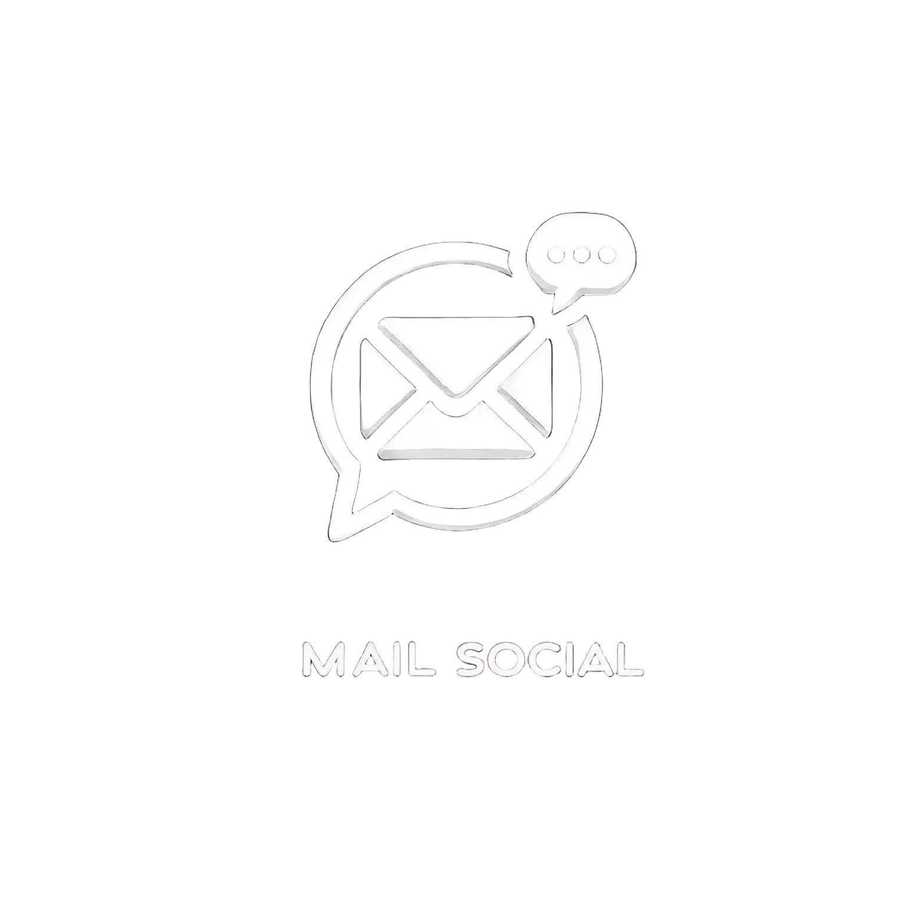

# Mail Social



    

Mail Social is an innovative email client that integrates social media and instant messaging features to enhance the way you connect with people. With Mail Social, you can discover new contacts, send and receive emails, and chat in real-time, all within a user-friendly interface. Built using customtkinter, Mail Social offers a modern and seamless experience for managing your communications.

## Features
- User-friendly email client interface
- Integration with IMAP and SMTP for email handling
- Instant messaging capabilities
- Built using customtkinter for modern UI design

## Licensing
Mail Social is licensed under the GNU General Public License v3.0 or later. See the license file in the root of the repo [./LICENSE.md](./LICENSE.md) for more details.

The documentation, including Sphinx and other materials inside the `./docs` folder, is licensed under the GNU Free Documentation License version 1.3 or later. See [./docs/LICENSE.md](./docs/LICENSE.md) for more information.

The assets, including icons, logos, and anything inside the `./assets` directory, are licensed under the Creative Commons Attribution-ShareAlike (CC BY-SA) license. See [./assets/LICENSE](./assets/LICENSE) for more information.

## Getting Started
To get started with Mail Social, follow these steps:

1. Clone the repository:
    ```sh
    git clone https://github.com/JamesClarke7283/MailSocial
    ```
2. Navigate into the project directory:
    ```sh
    cd MailSocial
    ```
3. (Optional) Create a virtual environment:
    ```sh
    python -m venv .venv
    source .venv/bin/activate  # On Windows use `.venv\Scripts\activate`
    ```
4. Install the project dependencies:
    ```sh
    pip install -e .
    ```

## Contributing
Contributors must add their copyright to the very top of the `LICENSE.md` file for any code changes. All code contributions will be licensed under the GNU General Public License v3.0 or later.
